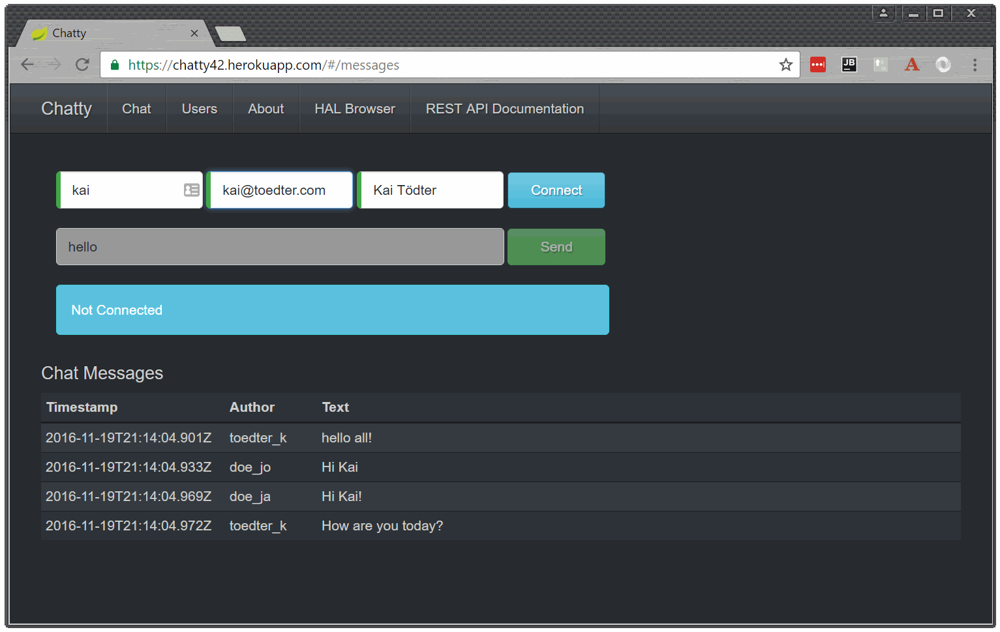

chatty [](https://travis-ci.org/toedter/chatty)
======

chatty - a chat demo that evaluates several technologies (and hopefully shows best practices)

Used Technologies
-----------------
* Java 8 (This demo will not run with any Java < 8)
* [HAL] (http://stateless.co/hal_specification.html) (Hypertext Application Language)
* [Atmosphere] (https://github.com/Atmosphere/atmosphere) (Async Pub/Sub)
* [Jersey] (https://jersey.java.net/) (JAX-RS reference implementation)
* [Spring Boot] (http://projects.spring.io/spring-boot/) (+ Data, REST, HATEOAS)
* [TypeScript] (http://www.typescriptlang.org/) for web client
* [AngularJS] (http://angularjs.org/) for web client
* [Protractor] (https://github.com/angular/protractor) for functional web client UI tests
* [JUnit] (http://junit.org/) for Java unit and integration testing
* [Mockito] (https://code.google.com/p/mockito/) for Mocking
* [Gradle] (http://www.gradle.org/) as build system

Requirements
------------
* Java 8 JDK installed
* Node.js installed
* Grunt CLI installed (npm install -g grunt-cli)
* Bower installed (npm install -g bower)
* TSD (TypeScript Definition Manager) installed (npm install -g tsd)

Getting Started
---------------
* ./gradlew build (builds all and runs the integration tests, both Java and TypeScript)
* ./gradlew startServerSync (starts a Jetty server using port 8080)
* Open [http://localhost:8080/src/main/webapp/chatty.html](http://localhost:8080/src/main/webapp/chatty.html) in a web browser
* Open [http://localhost:8080/src/main/webapp/chatty.html](http://localhost:8080/src/main/webapp/chatty.html) in another web browser
* Play around with chatty!

Screenshot
----------


Hypermedia API
--------------
Here is an example what you get at [http://localhost:8080/chatty/api/users](http://localhost:8080/chatty/api/users). Currently I am using [HAL] (http://stateless.co/hal_specification.html). The returnd mime type is "application/hal+json". To get a pretty print in Chrome, please install the Chrome extensions [JSONView] (https://chrome.google.com/webstore/detail/jsonview/chklaanhfefbnpoihckbnefhakgolnmc) and ["application/...+json|+xml as inline"](https://chrome.google.com/webstore/detail/application%20json%20xml-as-i/cgfnklamhhieaepdicnbahkbnolpbdmp)

```javascript
{
  _links: {
    self: {
      href: "http://localhost:8080/chatty/api/users",
      hreflang: "en",
      profile: "chatty"
    }
  },
  _embedded: {
    users: [
      {
         _links: {
           self: {
             href: "http://localhost:8080/chatty/api/users/toedter_k"
           }
         },
         email: "kai@toedter.com",
         fullName: "Kai Toedter",
         id: "toedter_k"
      }
    ]
  }
}
```

Spring Boot
------------
To run the Spring-Boot based server, invoke
java -jar subprojects/com.toedter.chatty.server.boot/build/libs/com.toedter.chatty.server.boot-1.0.jar

Then you can use [http://localhost:8080/api/](http://localhost:8080/api/) as enty point for exploring the HAL based API.

What's Next?
------------
* More tests
* Better TypeScript integration
* Integrate HAL browser

License
-------
MIT, see http://toedter.mit-license.org
